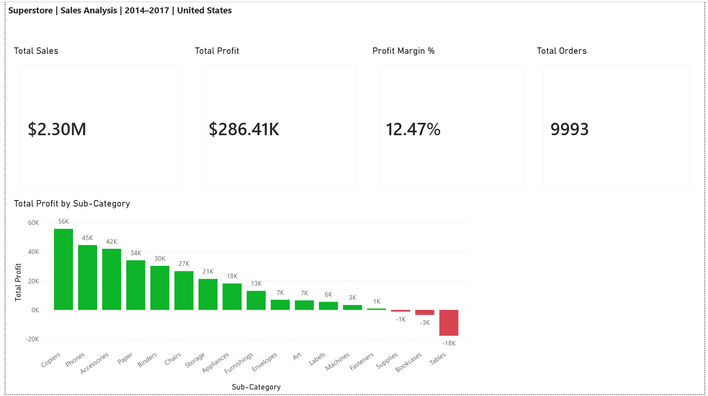
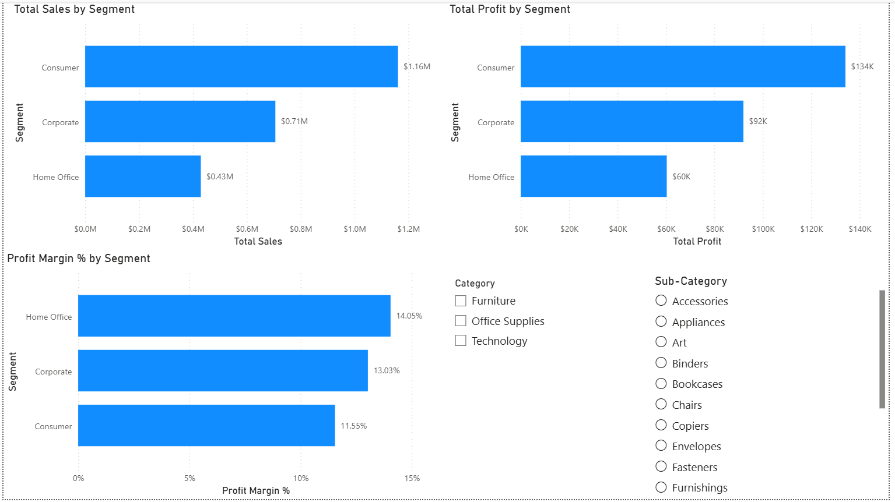
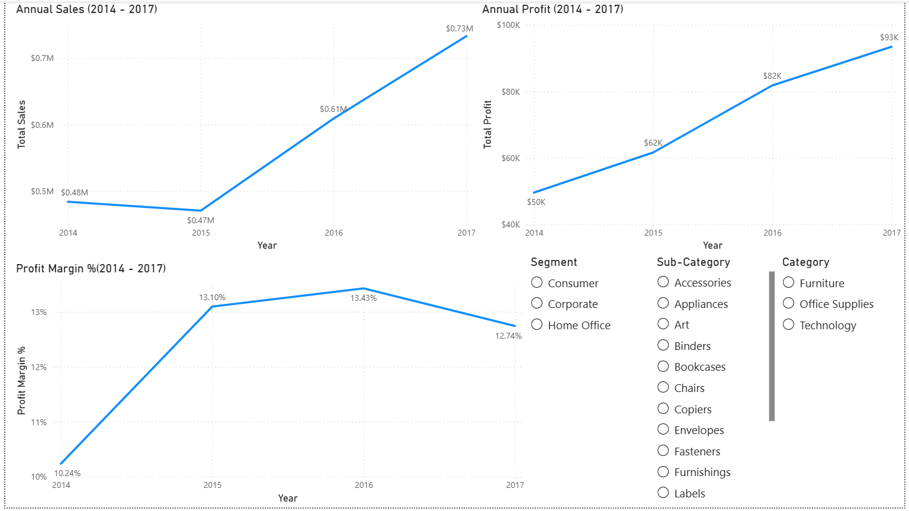
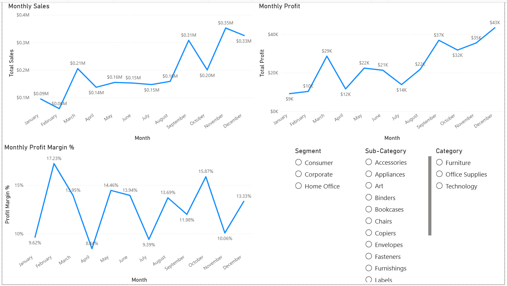
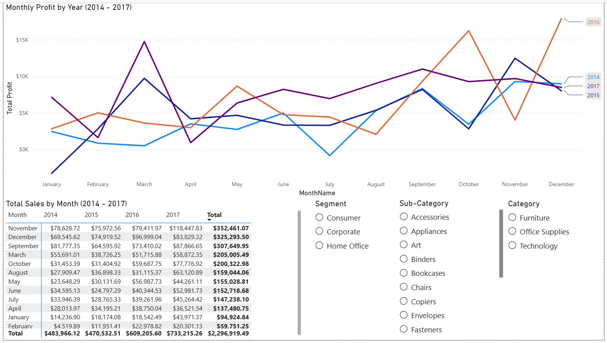
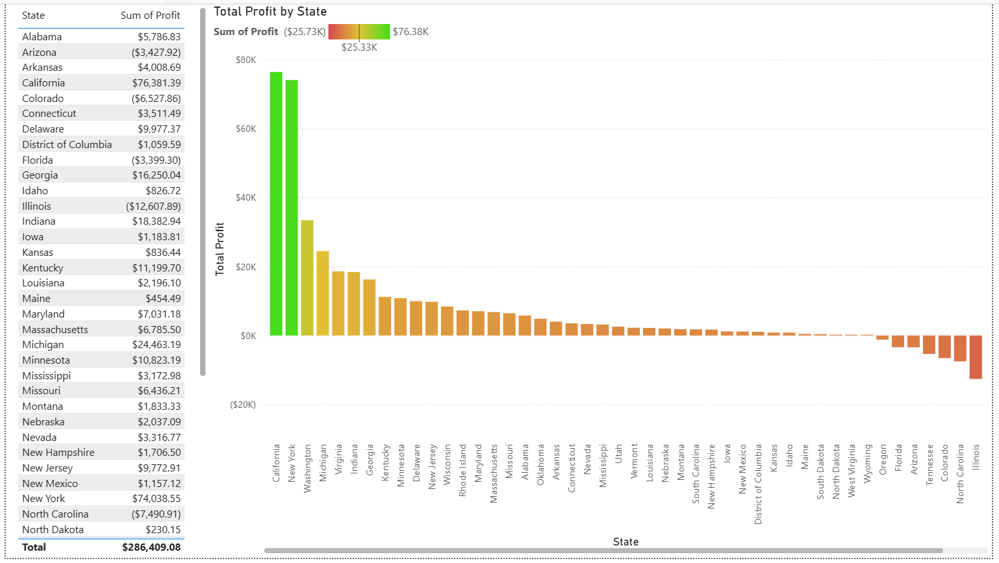
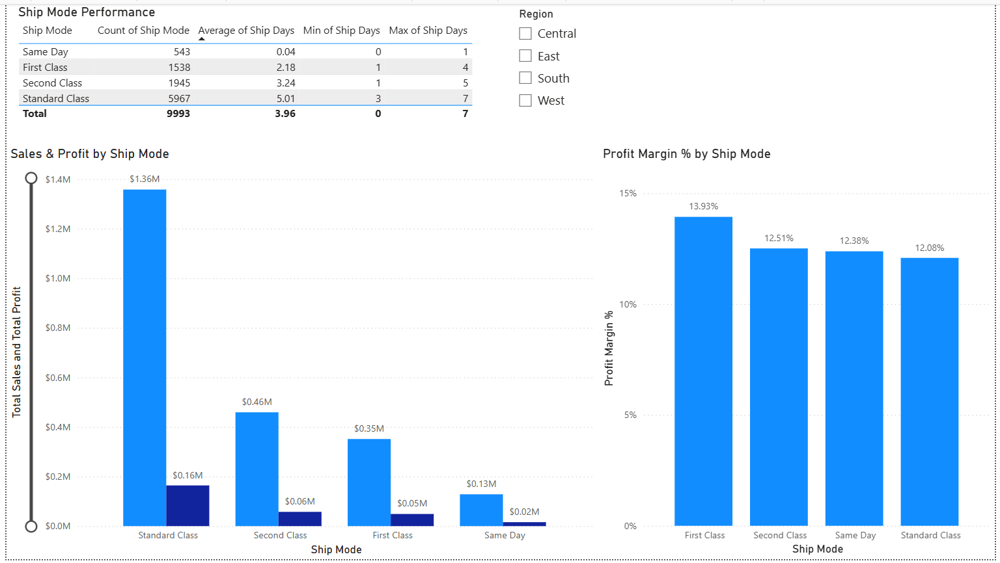
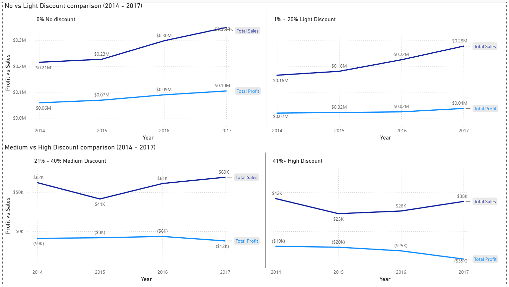
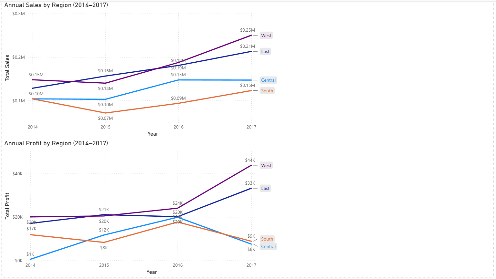

# Sample Superstore Sales Analysis — Excel & Power BI

## Overview

This project explores and analyses retail sales data from the Sample Superstore dataset using **Microsoft Excel** and **Power BI Desktop**.
The goal is to answer business and market-related questions through structured data cleaning, formula-based analysis, pivot table reporting, and interactive dashboard visualisation.

The analysis covers:
- Profitability breakdown by product sub-category, with identification of loss-making items
- The relationship between discount depth and profit margin erosion
- Sales and profit trends across customer segments, regions, years, and months
- State-level divergence between revenue volume and actual profitability
- Shipping mode performance and its relationship to margin

---

## Dashboard Preview

### Overview


### Segment Performance


### Annual Performance


### Monthly Performance


### Monthly Breakdown by Year


### State Profitability


### Shipping Analysis


### Discount Impact


### Regional Performance


---

## Objectives

This project aims to:
- Practice structured data cleaning and step-by-step documentation in Excel
- Build formula-based analysis sheets using SUMIF, COUNTIF, AVERAGEIF, and pivot tables
- Identify the profit margin aggregation pitfall in pivot tables and solve it correctly
- Design a multi-page Power BI report with a clear analytical narrative
- Apply DAX measures for correct profit margin calculation at any filter context
- Practice report layout, visual selection, conditional formatting, and interactivity design

---

## Pages & What They Show

| Page | Description |
|------|-------------|
| Overview | KPI cards (Total Sales, Total Profit, Profit Margin %, Total Orders) and a sub-category profit bar chart with green/red conditional formatting |
| Segment Performance | Total Sales, Total Profit, and Profit Margin % by Customer Segment (Consumer, Corporate, Home Office) |
| Annual Performance | Sales, Profit, and Profit Margin % trends from 2014 to 2017 |
| Monthly Performance | Sales, Profit, and Profit Margin % aggregated by month across all years |
| Monthly Breakdown by Year | Monthly Profit line chart with each year as a separate series, plus a Sales matrix showing month × year breakdown sorted by total |
| State Profitability | Total Profit by State bar chart with colour gradient (green = profit, red = loss), supported by a full state table |
| Shipping Analysis | Ship Mode performance table (count, avg/min/max days) + Sales & Profit bar chart + Profit Margin % by Ship Mode |
| Discount Impact | 4-panel Sales vs Profit comparison across discount buckets (0%, 1–20%, 21–40%, 41%+) from 2014–2017 |
| Regional Performance | Annual Sales and Annual Profit by Region (2014–2017) with each region as a separate line |

---

## Business Questions Explored

- Which product sub-categories generate the highest profit and which operate at a loss?
- At what discount level does profit margin turn negative?
- Which customer segment and region are most profitable?
- How have sales and profit evolved year over year from 2014 to 2017?
- Which months consistently deliver the highest profit?
- Are there states with high sales volume but poor or negative profitability?
- Do different shipping modes differ meaningfully in profitability and delivery speed?

---

## Excel Analysis

The Excel workbook (`SuperStore_Analysis.xlsx`) contains five sheets:

| Sheet | Contents |
|-------|----------|
| Raw Data | Original 9,993-row dataset with 9 added helper columns |
| Cleaning Log | 10 documented steps — action taken, reasoning, and result for every decision |
| Profitability | Pivot table of Profit & Sales by Category and Sub-Category with manual Profit Margin % column |
| Sales Performance | SUMIF/COUNTIF formula tables for Segment, Region, Year, Month, and State |
| Operations | Shipping performance and profitability by Ship Mode |

> **Note on Profit Margin in pivot tables:** Excel pivot tables force Profit Margin % to aggregate as sum, average, or count — all of which produce misleading results at summary level. The correct margin (Total Profit ÷ Total Sales) was calculated using a formula column referencing the pivot totals directly, consistent with standard financial analysis practice. The same principle was applied in Power BI using a DAX measure.

---

## Data Cleaning Summary

| # | Step | Result |
|---|------|--------|
| 1 | Formatted as Excel Table; applied freeze panes | Filter headers on all columns |
| 2 | Corrected column data types | Dates, currency, percentage, number, text |
| 3 | Null check via COUNTBLANK | No null values found in any column |
| 4 | Duplicate detection and removal | 2 true duplicates removed; 7 split shipments identified and retained |
| 5 | Added Ship Days column | Ship Date − Order Date; range 0–7 days |
| 6 | Added Profit Margin % column | Profit ÷ Sales; avoids misleading pivot averages |
| 7 | Extracted Year and Month columns | Enables time-series analysis without date functions in every formula |
| 8 | Flagged split shipments | 7 pairs (14 rows) labelled and retained |
| 9 | Created Discount Bucket column | 4 buckets: 0%, 1–20%, 21–40%, 41%+ |

---

## Power BI Concepts Used

- Bar Chart, Line Chart, and Matrix visuals
- KPI card visuals
- Conditional formatting via colour gradient and calculated columns
- Slicers (list and dropdown)
- Cross-filtering between visuals
- DAX calculated measures and calculated columns
- Power Query for data preparation

---

## DAX

```dax
-- Correct profit margin at any filter context
-- Avoids the misleading result of averaging row-level Profit Margin % values
Profit Margin % = DIVIDE(SUM('RawData_PowerBi'[Profit]), SUM('RawData_PowerBi'[Sales]))

-- Profit Status column for conditional formatting on State Profitability page
Profit Status =
SWITCH(
    TRUE(),
    'RawData_PowerBi'[Profit Margin %] > 0, "Gain",
    'RawData_PowerBi'[Profit Margin %] < 0, "Loss",
    "No Change"
)
```

---

## Key Findings

- **Tables** (-8.6% margin) and **Bookcases** (-3.0%) generate revenue but operate at a loss, driven by heavy discounting (avg. 26.1% and 21.1% respectively)
- Profit margin turns negative at the 21–40% discount bracket and deteriorates sharply beyond 41%
- **Technology** is the most profitable category overall (17.4% margin); **Copiers** lead all sub-categories at 37.2%
- The **West region** outperforms all others across sales, profit, and margin (14.9%)
- The **Home Office segment** achieves the highest profit margin (14.0%) despite being the smallest by revenue
- **November, September, and December** are consistently the most profitable months, reflecting Q4 purchasing patterns
- **Texas** and **North Carolina** rank among the top states by revenue yet both record a net loss, while **Indiana** (34.3%) and **Michigan** (32.1%) generate strong returns on lower revenue
- **First Class** shipping achieves the highest profit margin (13.93%) despite not being the most frequently used mode

---

## Dataset

- **Source:** [Sample Superstore — Kaggle](https://www.kaggle.com/datasets/vivek468/superstore-dataset-final)
- **Original file:** `Prime_dataset/RawDataSet-Superstore.csv`
- **Power BI source:** `dataset/RawData_PowerBi.csv` (cleaned Raw Data sheet exported from Excel)
- **Rows:** 9,993 (after removing 2 confirmed duplicates)
- **Columns:** 21 original + 7 helper columns added during cleaning
- **Period:** 2014 – 2017 
- **Market:** United States

---

## Project Structure

```text
superstore-sales-analysis/
│
├── README.md
├── Prime_dataset/
│   └── RawDataSet-Superstore.csv          
├── analysis_dataset/
│   └── SuperStore_Analysis.xlsx        
├── dashboard/
│   └── Superstore_Dashboard.pbix  
├── dataset/
│   └──RawData_PowerBi.csv      
└── Screenshots/
    ├── 01_Overview.png
    ├── 02_Segment_Performance.png
    ├── 03_Annual_Performance.png
    ├── 04_Monthly_Performance.png
    ├── 05_Monthly_Breakdown_by_Year.png
    ├── 06_State_Profitability.png
    ├── 07_Shipping_Analysis.png
    ├── 08_Discount_Impact.png
    └── 09_Regional_Performance.png
```

---

## How to Open

**Excel workbook:**
1. Download `analysis_dataset/SuperStore_Analysis.xlsx`
2. Open with Microsoft Excel 2016 or later

**Power BI dashboard:**
1. Download `dashboard/Superstore_Dashboard.pbix`
2. Open with [Power BI Desktop](https://powerbi.microsoft.com/desktop/) (free)
3. If prompted about data sources, repoint to `dataset/RawData_PowerBi.csv`

---

## Tools Used

- Microsoft Excel
- Power BI Desktop
- DAX (Data Analysis Expressions)
- GitHub

---

## Related Projects

- [European Household Energy Consumption Power BI](https://github.com/panagiotisflrs/eurostat-household-energy-PowerBi.git)
- [VideoGames Sales PowerBi](https://github.com/panagiotisflrs/video-game-sales-PowerBi.git)
